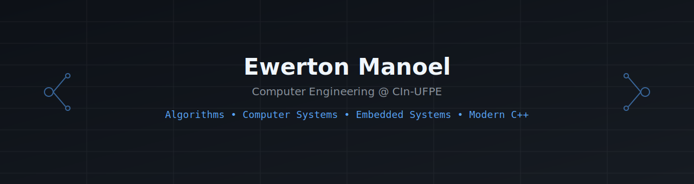

  

<h2 align="center">Ewerton Manoel</h2>

Computer Engineering Student @ <b>CIn-UFPE</b> 
Interested in Algorithms, Systems Programming and Software Engineering

  
  
  

  

---

## About Me

I enjoy exploring computer science fundamentals through implementation and problem solving.

My main interests are algorithm design, data structures, competitive programming, and systems programming.

---

## Focus Areas

- Data Structures & Algorithms
- Competitive Programming
- Systems Programming
- Modern C++

---

  
  

